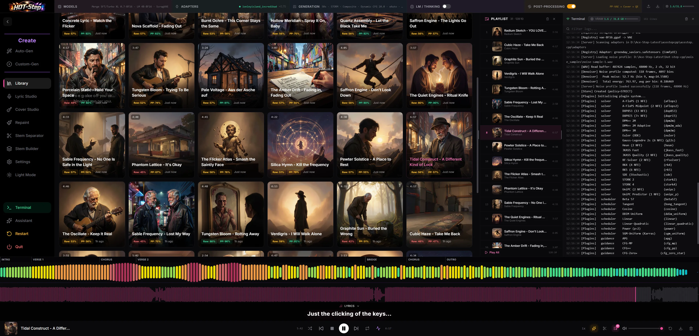
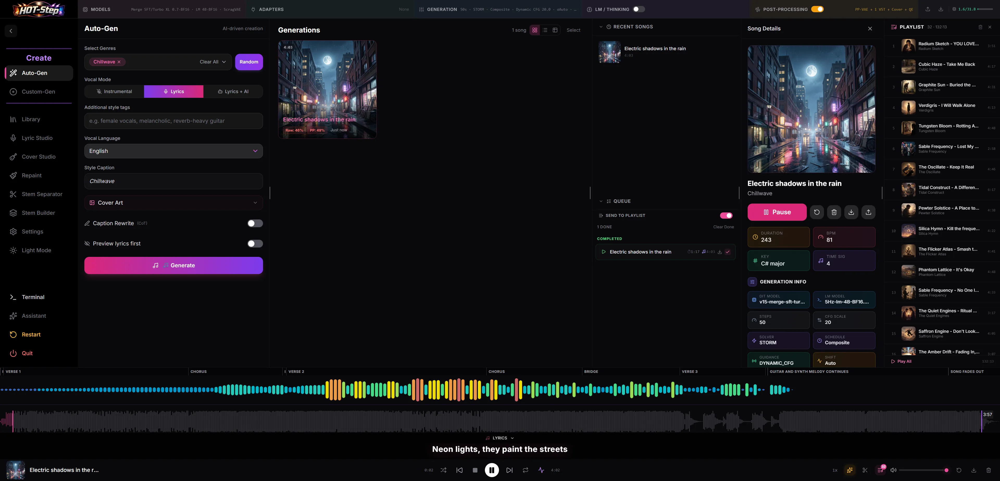
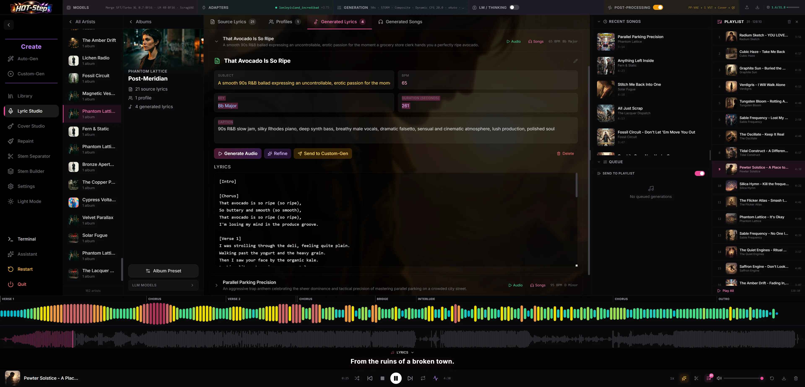
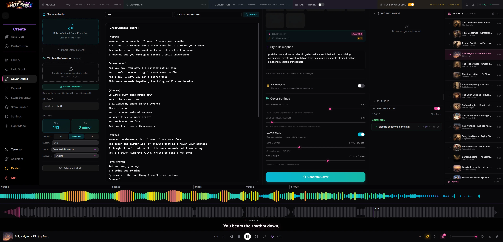
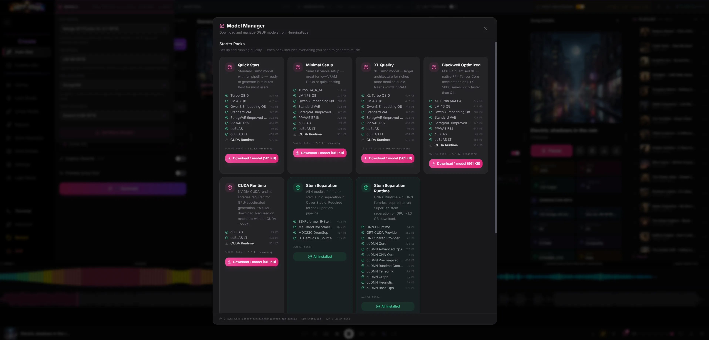

# HOT-Step CPP

A feature-rich UI for [acestep.cpp](https://github.com/ServeurpersoCom/acestep.cpp) — local AI music generation powered by GGML.

Describe a song with a text caption and lyrics, and get stereo 48kHz audio generated entirely on your local hardware. No cloud, no API keys, no subscriptions.

## Download

Pre-built portable releases — no installation required. Extract, run, done.

**[📥 Download the latest release →](https://github.com/scragnog/HOT-Step-CPP/releases/latest)**

| Platform | Variants |
|----------|----------|
| **Windows** (x64) | CUDA (NVIDIA), Vulkan (AMD/Intel/NVIDIA), CPU |
| **Linux** (x64) | CUDA (NVIDIA), Vulkan (AMD/Intel/NVIDIA), CPU |
| **macOS** (Apple Silicon) | Metal (M1/M2/M3/M4) |

**Which variant?**
- **CUDA** — Best performance. Use this if you have an NVIDIA GPU (RTX 2060 or newer recommended).
- **Vulkan** — Cross-vendor GPU support. Use this if you have an AMD or Intel GPU, or an older NVIDIA card.
- **CPU** — No GPU needed. Works on any machine but generation will be significantly slower.

### Quick Start

**Windows:**
1. Download and extract the zip for your hardware
2. Run **`HOT-Step.bat`**
3. Your browser opens to `http://localhost:3001`
4. On first launch, go to **Models → Get More Models** to download the AI models (~7 GB)

**Linux:**
1. Download and extract the `.tar.gz` for your hardware
2. Run **`./HOT-Step.sh`**
3. Open `http://localhost:3001` in your browser
4. On first launch, go to **Models → Get More Models** to download the AI models (~7 GB)

**macOS:**
1. Download and extract the `.tar.gz`
2. Open Terminal in the extracted folder and run **`./HOT-Step.sh`**
3. Your browser opens to `http://localhost:3001`
4. On first launch, the **Model Manager** opens automatically — download the AI models (~7 GB)

> **Windows requirements:** Windows 10/11 (64-bit), ~10 GB free disk space. CUDA variant needs NVIDIA drivers. Vulkan variant needs Vulkan 1.1+ capable drivers.

> **Linux requirements:** Ubuntu 22.04+ or equivalent (x86_64), ~10 GB free disk space. CUDA variant needs NVIDIA drivers 525+. Vulkan variant needs Vulkan 1.1+ capable drivers and `libvulkan1`.

> **macOS requirements:** macOS 13+ (Apple Silicon M1/M2/M3/M4), ~10 GB free disk space. No other software needed — Node.js is bundled. If macOS blocks the app (unsigned binary), run: `xattr -cr /path/to/HOT-Step-CPP/`

---

## Highlights

HOT-Step CPP extends the base acestep.cpp engine with 80+ features across inference, audio processing, and creative tooling. Here are the big ones:

🎛️ **17 Solvers, 9 Schedulers, 7 Guidance Modes** — Fully extensible Lua plugin architecture for ODE/SDE solvers, noise schedulers, and guidance modes. Drop a `.lua` file into `engine/plugins/` and it appears in the UI at next launch — no C++ rebuild needed. Includes research-derived modes like CFG-MP (manifold projection), SMC-CFG (sliding mode control), and CFG-Zero⋆ (zero-init). Each plugin can expose its own user-facing parameters (sliders, toggles, dropdowns). **[Create your own →](docs/PLUGINS.md)**

🎸 **LoRA Adapters with Runtime Mode** — Per-group scale controls (self_attn, cross_attn, mlp, cond_embed), K-quant GPU support via custom CUDA kernels, and a runtime LoRA mode that applies deltas in the forward pass without permanently merging weights.

🎚️ **Matchering Mastering Engine** — Loudness, EQ, and dynamics matching to a reference track with instant mastered/unmastered A/B toggle. Operates at native 48kHz — no resample round-trip.

🤖 **Auto-Gen** — AI-driven song creation. Pick genres, optionally set a subject and language, and the LM handles everything — lyrics, style caption, metadata, and title. Three lyric modes: fully AI-generated, AI-written from your subject, or instrumental. Preview mode lets you review and edit AI-generated lyrics before committing to generation. Serial queue ensures one job at a time with live progress tracking.

🎹 **Custom-Gen** — Full manual control over every generation parameter. Write your own lyrics (or go instrumental), set a style caption, title, artist, BPM, duration, key signature, and time signature. Direct access to all engine settings with queue-based generation. The power-user mode for when you know exactly what you want.

🔌 **VST3 Host** — Scan, load, and run your existing VST3 plugins directly in the generation pipeline. Offline processing and real-time WASAPI monitor mode with transport controls.

✍️ **Lyric Studio** — A complete AI-powered lyrics and music workspace. 6 LLM providers (Gemini, LM Studio, OpenAI-compatible), artist profiles with adapter presets, statistical lyric analysis, bulk generation with "Fill to N" mode, and full parameter parity with the Create page.

🎤 **Cover Studio** — Upload a reference track, get Essentia-based analysis (BPM, key, energy, timbre), and generate style-matched covers. Artist-optional workflow with editable style descriptions, pitch shift with key transposition preview, tempo scaling, stem separation + recombination, and per-album adapter presets.

🔪 **Stem Studio** — 4-stage neural stem separation powered by SuperSep. BS-RoFormer for primary 6-stem splits, Mel-Band RoFormer for lead/backing vocal isolation, MDX23C for drum sub-separation, and HTDemucs for instrument refinement. Interactive mixer with multi-solo, per-stem volume controls, and ZIP export. Sequential VRAM management keeps peak usage under 3 GB.

🧱 **Stem Builder** — Generatively create new instrument stems for source tracks using the DiT engine. Select a source audio file, choose which instrument layers to generate (vocals, drums, bass, guitar, piano), and the engine creates fresh stems that complement the original. Build up arrangements by iteratively adding AI-generated layers.

🔊 **Audio Post-Processing** — Spectral denoiser (Wiener-filter), Spectral Lifter (native C++), PP-VAE neural audio polish, Vocal Naturalizer (5-stage DSP humanization, experimental — may affect downstream processing), duration buffer with auto-trim for clean endings, and configurable fade-out.

📊 **Audio Quality Evaluator** — Automatic post-generation quality scoring using spectral analysis. Three weighted metrics — metallic sound detection (spectral rolloff), word cut detection (spectral flux discontinuities), and noise/hiss analysis (zero-crossing rate) — produce a 0–100% score per track. Choose to evaluate unmastered, mastered, or both for direct comparison. Scores display as colour-coded badges in the Library. Ported from [JK-AceStep-Nodes](https://github.com/jeankassio/JK-AceStep-Nodes) (MIT License).

🤖 **AI Assistant** — In-app LLM-powered assistant with full awareness of your current settings, lyrics, mode, and engine state. Ask it to review your configuration, write or rewrite lyrics, suggest optimizations, or directly apply setting changes — all via a streaming chat sidebar. Supports any configured LLM provider (local or cloud) with per-action apply controls and thinking/response separation.

🧪 **Latent Space Controls** — Latent shift, latent rescale, custom timestep scheduling, DCW (Differential Correction in Wavelet domain) sampling, and auto-shift for adaptive noise scaling.

📦 **Lossless Pipeline** — WAV32 throughout the processing chain, with export to WAV, MP3, or FLAC.

📥 **In-App Model Manager** — Browse 100+ GGUF models across 5 HuggingFace repos, download with curated starter packs, and manage your model library without leaving the app. Concurrent resumable downloads with real-time progress.

🧬 **PP-VAE & ScragVAE** — Two custom VAE models. PP-VAE runs a neural encode→decode polish pass on generated audio to smooth spectral artifacts. ScragVAE is a fine-tuned decoder with improved high-frequency energy and dynamic range — both selectable at runtime.

👉 **[See the full feature list →](FEATURES.md)**

## Gallery

### Library
Browse your generated songs as a cover art grid with AI-generated artwork, quality scores, and audio metadata. The right sidebar shows a live playlist and engine terminal output. The bottom bar features a waveform visualizer with section markers (verse, chorus, bridge) and real-time synced lyrics.



### Auto-Gen
AI-driven music creation — pick a genre, set a vocal mode, and the LLM handles everything else. The song details panel shows full generation metadata: models used, solver, scheduler, CFG scale, key signature, time signature, and duration.



### Lyric Studio
A complete AI-powered lyrics workspace. Browse artists and albums on the left, view and edit AI-generated lyrics with structural section tags in the centre, and manage your generation queue on the right. Supports multiple LLM providers for lyric generation and refinement.



### Cover Studio
Upload a reference track for automatic BPM and key detection via Essentia analysis. The engine extracts style descriptions, lyrics, and structural metadata. Fine-tune cover settings including structure fidelity, source preservation, pitch shift with key transposition, and tempo scaling.



### Model Manager
Browse curated starter packs tailored to different hardware tiers — from minimal setups to Blackwell-optimized configurations. Download individual GGUF models, stem separation networks, and CUDA/cuDNN runtime libraries directly from HuggingFace without leaving the app.



---

## Architecture

HOT-Step CPP is three components working together:

| Component | Tech | Purpose |
|-----------|------|---------|
| **Engine** | C++ / CUDA / GGML | The acestep.cpp inference engine — runs the AI models |
| **Server** | Node.js / TypeScript | Orchestrates the engine, manages songs, serves the UI |
| **UI** | React / Vite / TypeScript | The browser-based frontend |

## Platform Support

| Platform | Status |
|----------|--------|
| Windows + NVIDIA (CUDA) | ✅ Pre-built release available |
| Windows + AMD/Intel (Vulkan) | ✅ Pre-built release available |
| Windows CPU-only | ✅ Pre-built release available |
| macOS Apple Silicon (Metal) | ✅ Pre-built release available |
| Linux + NVIDIA (CUDA) | ✅ Pre-built release available |
| Linux + AMD/Intel (Vulkan) | ✅ Pre-built release available |
| Linux CPU-only | ✅ Pre-built release available |

---

## Building from Source

If you prefer to build from source (or want to contribute), follow the instructions below. **Most users should use the [pre-built releases](#download) instead.**

### Windows

#### Prerequisites

| Requirement | Version | Notes |
|-------------|---------|-------|
| [Visual Studio 2022 Build Tools](https://visualstudio.microsoft.com/visual-cpp-build-tools/) | 2022 | Select "Desktop development with C++" workload |
| [CUDA Toolkit](https://developer.nvidia.com/cuda-downloads) | 12.x+ | For NVIDIA GPU acceleration. **Select "Visual Studio Integration" during install.** |
| [CMake](https://cmake.org/download/) | 3.14+ | Usually included with VS Build Tools |
| [Node.js](https://nodejs.org/) | 18–22 LTS | **Node 24+ is not supported** — use nvm to install 22 LTS if needed |
| [Git](https://git-scm.com/) | Any | For cloning |

#### 1. Clone the repo

```cmd
git clone --recursive https://github.com/scragnog/HOT-Step-CPP.git
cd HOT-Step-CPP
```

> **Already cloned without `--recursive`?** Run `git submodule update --init --recursive` to fetch the ggml and vst3sdk submodules.

#### 2. Build the engine

The easiest way:

```cmd
engine\build.cmd
```

This automatically finds your Visual Studio installation (any edition) and builds with CUDA.

Alternatively, open a **Developer Command Prompt for VS 2022** and build manually:

```cmd
cd engine
mkdir build
cd build
cmake .. -DGGML_CUDA=ON -DCMAKE_CUDA_ARCHITECTURES=native
cmake --build . --config Release -j %NUMBER_OF_PROCESSORS%
cd ..\..
```

> **Note:** If you use **Ninja** as your CMake generator (`-G Ninja`), binaries will be placed directly in `engine/build/` rather than `engine/build/Release/`. The server auto-detects both locations.

#### 3. Download models

Download four GGUF model files from [Hugging Face](https://huggingface.co/Serveurperso/ACE-Step-1.5-GGUF/tree/main) and place them in a `models/` directory at the repo root:

```
HOT-Step-CPP/
├── models/                          ← create this, put GGUFs here
│   ├── acestep-5Hz-lm-4B-Q8_0.gguf
│   ├── Qwen3-Embedding-0.6B-Q8_0.gguf
│   ├── acestep-v15-turbo-Q8_0.gguf
│   └── vae-BF16.gguf
├── engine/
├── server/
└── ui/
```

| Type | Recommended File | Size |
|------|-----------------|------|
| LM | `acestep-5Hz-lm-4B-Q8_0.gguf` | 4.2 GB |
| Text Encoder | `Qwen3-Embedding-0.6B-Q8_0.gguf` | 748 MB |
| DiT | `acestep-v15-turbo-Q8_0.gguf` | 2.4 GB |
| VAE | `vae-BF16.gguf` | 322 MB |

Smaller LM variants available: 0.6B (fast) and 1.7B (balanced).

#### Optional (recommended)

| Type | File | Size | Source |
|------|------|------|--------|
| ScragVAE | `scragvae-BF16.gguf` | 322 MB | [scragnog/Ace-Step-1.5-ScragVAE](https://huggingface.co/scragnog/Ace-Step-1.5-ScragVAE) |
| PP-VAE | `pp-vae-F32.gguf` | 644 MB | [scragnog/HOT-Step-CPP-PP-VAE](https://huggingface.co/scragnog/HOT-Step-CPP-PP-VAE) |

**ScragVAE** is a fine-tuned VAE decoder with improved high-frequency energy and dynamic range — drop-in replacement for the standard VAE. **PP-VAE** enables neural audio polish via an encode→decode round-trip in the post-processing chain.

> **💡 Tip:** You can also download models directly from the app! Click **Models → Get More Models** to browse 100+ models across 5 HuggingFace repos, with curated starter packs for quick setup.

#### 4. Install UI & server dependencies

```cmd
install.bat
```

Or manually (PowerShell):

```powershell
cd server; npm install; cd ..
cd ui; npm install; cd ..
```

#### 5. Run

```cmd
LAUNCH.bat
```

Open `http://localhost:3001` in your browser. That's it!

> **No `.env` file needed** for the standard setup. The server automatically finds the engine binary (checks `engine/build/Release/`, `engine/build/`, and `engine/build/Debug/`) and models at `models/`. See `.env.example` if you need to override paths for a custom setup.

**Development mode** (with hot-reload):
```cmd
dev.bat
```
Then open `http://localhost:3000`.

---

### macOS (Apple Silicon)

#### Prerequisites

| Requirement | Version | Notes |
|-------------|---------|-------|
| Xcode Command Line Tools | 16+ | `xcode-select --install` |
| CMake | 3.14+ | `brew install cmake` |
| Node.js | 18–22 LTS | `brew install node@22` — **Node 24+ is not supported** |
| Git | Any | Included with Xcode CLI tools |

> **Note:** Xcode provides the Metal SDK and C++ compiler. No separate GPU toolkit is needed — Metal support is built into macOS.

#### 1. Clone the repo

```bash
git clone --recursive https://github.com/scragnog/HOT-Step-CPP.git
cd HOT-Step-CPP
```

> **Already cloned without `--recursive`?** Run `git submodule update --init --recursive` to fetch the ggml and vst3sdk submodules.

#### 2. Build the engine

```bash
cd engine
mkdir build && cd build
cmake .. -DGGML_METAL=ON -DGGML_METAL_EMBED_LIBRARY=ON -DCMAKE_BUILD_TYPE=Release
cmake --build . --config Release -j $(sysctl -n hw.ncpu)
cd ../..
```

> This builds with Metal GPU acceleration. The Metal shader library is embedded into the binary so no external `.metallib` file is needed at runtime.

#### 3. Download models

Same as Windows — place GGUF files in `models/`. See [model list above](#3-download-models). Or skip this and download from the in-app Model Manager on first launch.

#### 4. Install UI & server dependencies

```bash
cd server && npm install && cd ..
cd ui && npm install && cd ..
```

#### 5. Run

```bash
./launch.sh
```

Open `http://localhost:3001` in your browser.

> **No `.env` file needed** for the standard setup. The server automatically finds the engine binary and models. See `.env.example` if you need to override paths.

**Development mode** (with hot-reload):
```bash
./launch.sh  # In one terminal
cd ui && npx vite  # In another terminal
```
Then open `http://localhost:3000`.

---

### Linux (x86_64)

#### Prerequisites

| Requirement | Version | Notes |
|-------------|---------|-------|
| GCC / Clang | GCC 11+ | `sudo apt install build-essential` |
| CMake | 3.14+ | `sudo apt install cmake` |
| Node.js | 18–22 LTS | **Node 24+ is not supported** |
| Git | Any | `sudo apt install git` |
| CUDA Toolkit (optional) | 12.x+ | For NVIDIA GPU acceleration |
| Vulkan SDK (optional) | Latest | For AMD / Intel GPU acceleration |

#### 1. Clone the repo

```bash
git clone --recursive https://github.com/scragnog/HOT-Step-CPP.git
cd HOT-Step-CPP
```

> **Already cloned without `--recursive`?** Run `git submodule update --init --recursive` to fetch the ggml and vst3sdk submodules.

#### 2. Build the engine

**CUDA (NVIDIA GPU):**
```bash
cd engine
mkdir -p build && cd build
cmake .. -DGGML_CUDA=ON -DCMAKE_BUILD_TYPE=Release
cmake --build . -j $(nproc)
cd ../..
```

**Vulkan (AMD / Intel / NVIDIA):**
```bash
# Install Vulkan SDK first: https://vulkan.lunarg.com/sdk/home
cd engine
mkdir -p build && cd build
cmake .. -DGGML_VULKAN=ON -DCMAKE_BUILD_TYPE=Release
cmake --build . -j $(nproc)
cd ../..
```

**CPU-only:**
```bash
cd engine
mkdir -p build && cd build
cmake .. -DCMAKE_BUILD_TYPE=Release
cmake --build . -j $(nproc)
cd ../..
```

#### 3. Download models

Same as Windows — place GGUF files in `models/`. See [model list above](#3-download-models). Or skip this and download from the in-app Model Manager on first launch.

#### 4. Install UI & server dependencies

```bash
cd server && npm install && cd ..
cd ui && npm install && cd ..
```

#### 5. Run

```bash
./launch.sh
```

Open `http://localhost:3001` in your browser.

> **No `.env` file needed** for the standard setup. The server automatically finds the engine binary and models. See `.env.example` if you need to override paths.

---

### Building a Portable Release

You can package a self-contained, zero-prerequisite release for distribution. The resulting archive bundles everything — engine binaries, Node.js runtime, server, UI, and plugins — so end users just extract and run.

#### macOS

```bash
./package-release.sh
```

This will:
1. Build the C++ engine with Metal GPU acceleration
2. Install production server dependencies
3. Build the optimised production UI
4. Download and bundle a Node.js 22 runtime (~40 MB)
5. Package everything into a `.tar.gz`

Options:
```bash
./package-release.sh --skip-build          # Skip engine build (use existing binaries)
./package-release.sh --version=1.2.0       # Set version number
```

The output archive is fully portable — no brew, no npm, no Xcode needed on the target machine. The bundled `launch.sh` auto-detects and uses the included Node.js runtime.

---

## Troubleshooting

<details>
<summary><b>MSVC error C2589: illegal token on right side of '::'</b></summary>

This happens when `Windows.h` defines `min`/`max` as macros, which collide with `std::min`/`std::max`. The CMakeLists.txt should already define `NOMINMAX` — if you're seeing this, pull the latest version.

If building manually, add `-DCMAKE_CXX_FLAGS="/DNOMINMAX /DWIN32_LEAN_AND_MEAN"` to your cmake command.
</details>

<details>
<summary><b>npm install fails on Node.js 24+</b></summary>

Node.js 24 is too new for some dependencies. Use Node.js 22 LTS:

```cmd
nvm install 22
nvm use 22
```
</details>

<details>
<summary><b>build.cmd can't find vcvars64.bat</b></summary>

The build script uses `vswhere.exe` to find Visual Studio automatically. If it fails:

1. Make sure you have **Visual Studio 2022** (any edition) or **Build Tools** installed
2. Ensure the **"Desktop development with C++"** workload is selected
3. As a fallback, open a **Developer Command Prompt for VS 2022** and build manually (see Build the Engine above)
</details>

<details>
<summary><b>"ace-server.exe not found" after building with Ninja</b></summary>

Ninja is a single-config generator — binaries go directly in `engine/build/` instead of `engine/build/Release/`. The server auto-detects both locations. If you still see this error, pull the latest version or set `ACESTEPCPP_EXE` in your `.env` file to point to the binary.
</details>

<details>
<summary><b>CUDA error: "The CUDA Toolkit directory does not exist"</b></summary>

MSBuild can't find the CUDA Toolkit. Check:

1. The `CUDA_PATH` environment variable is set (e.g. `C:\Program Files\NVIDIA GPU Computing Toolkit\CUDA\v12.x`)
2. You selected **"Visual Studio Integration"** during the CUDA Toolkit install — without this, MSBuild has no `$(CudaToolkitDir)` macro
3. Restart your terminal after installing or modifying CUDA paths
</details>

<details>
<summary><b>"The input line is too long" when running build.cmd</b></summary>

Running `build.cmd` multiple times in the same terminal causes `vcvars64.bat` to append duplicate entries to `%PATH%` until it exceeds the Windows 8,192-character limit.

**Fix:** Close the terminal and open a fresh one. The build scripts now guard against this, but older versions don't — pull latest.
</details>

<details>
<summary><b>Build errors persist after fixing environment</b></summary>

If you changed CUDA versions, VS editions, or environment variables, the CMake cache may contain stale configuration:

```cmd
rd /s /q engine\build
engine\build.cmd
```

The `CMakeCache.txt` is only generated once — `build.cmd` skips reconfiguration if it already exists.
</details>

<details>
<summary><b>macOS: "operation not permitted" or app blocked by Gatekeeper</b></summary>

Since the release binaries are unsigned, macOS may quarantine them. Remove the quarantine flag:

```bash
xattr -cr /path/to/HOT-Step-CPP-v1.0.0-macOS-arm64/
```

This only needs to be done once after extraction.
</details>

<details>
<summary><b>macOS: Metal compilation errors during engine build</b></summary>

Ensure you have Xcode (not just Command Line Tools) and run the first-launch setup:

```bash
sudo xcodebuild -runFirstLaunch
```

If you see errors about Metal Toolchain, these can usually be ignored — the embedded Metal library (`-DGGML_METAL_EMBED_LIBRARY=ON`) does not require a separate Metal Toolchain download.
</details>

## Credits

- **[ACE-Step 1.5](https://github.com/ace-step/ACE-Step-1.5)** — The AI music generation model by ACE Studio and StepFun
- **[acestep.cpp](https://github.com/ServeurpersoCom/acestep.cpp)** — The C++ GGML inference engine by ServeurpersoCom
- **[HOT-Step 9000](https://github.com/scragnog/HOT-Step-9000)** — The Python-based sister project with full feature support
- **[ComfyUI_MusicTools](https://github.com/jeankassio/ComfyUI_MusicTools)** — Vocal Naturalizer DSP algorithm by Jean Kassio (MIT License)
- **[JK-AceStep-Nodes](https://github.com/jeankassio/JK-AceStep-Nodes)** — Audio Quality Evaluator metrics by Jean Kassio (MIT License)

## License

The engine component (`engine/`) is licensed under MIT. See [engine/LICENSE](engine/LICENSE) for details.
