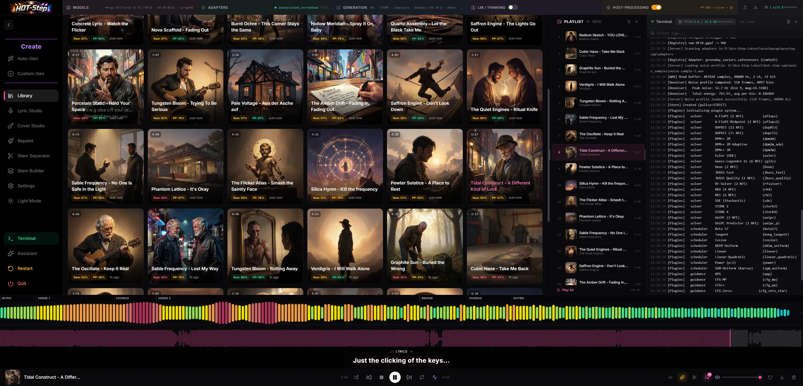
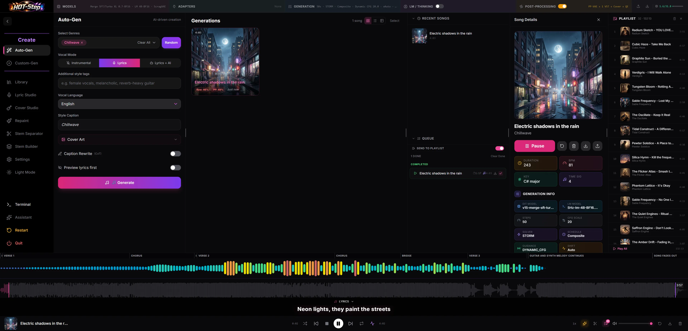
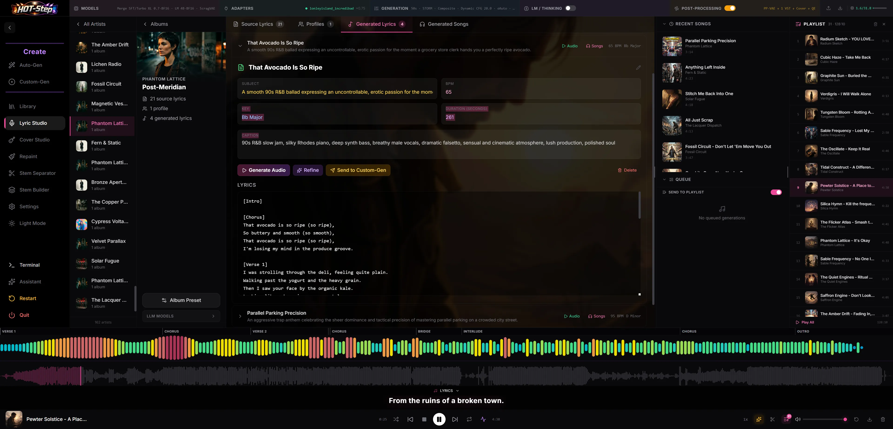
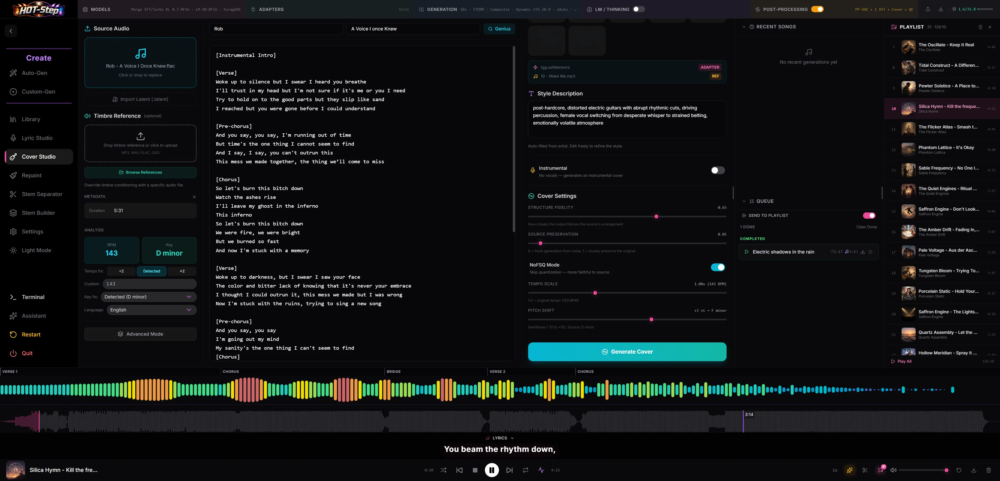
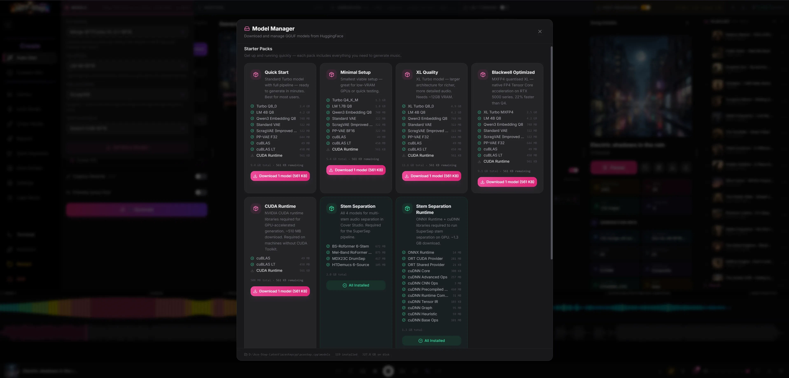

# HOT-Step CPP

A feature-rich UI for [acestep.cpp](https://github.com/ServeurpersoCom/acestep.cpp), local AI music generation powered by GGML, with native safetensors support. Two music models run natively in the engine: **ACE-Step 1.5** and **MiniMax-Music3**, switchable from the toolbar.

Describe a song with a text caption and lyrics, and get stereo 48kHz audio generated entirely on your local hardware. No cloud, no API keys, no subscriptions.

[](https://discord.gg/ezVtmg9GKX)
[](https://buymeacoffee.com/scragnog)
[](https://huggingface.co/scragnog)

💬 **Questions, feedback, or want to share what you've made?** [Join the Discord](https://discord.gg/ezVtmg9GKX) — it's where I'm most active for HOT-Step discussion and support.

> ### 🎓 Training Studio *(experimental, but it works)*
> Train your own **style adapters entirely inside HOT-Step**, with no Python and no external tools. Point it at a folder of songs and it walks the whole pipeline: **dataset creation** (local BPM/key analysis, lyrics from Genius, and AI captions from a captioning model that runs on your own machine), **tensor preprocessing**, then native **training** in C++/GGML on your GPU.
>
> It trains adapters for **both models**. For ACE-Step that's planner LM LoRA (0.6B/1.7B/4B) and DiT LoRA. For MiniMax-Music3 it's planner LM LoRA/LoKr and flow-DiT LoRA.
>
> **It fits on a normal card.** Training against a quantized base takes the VRAM floor from 31.4 GB down to around 10 GB, which is what makes MM3 adapter training possible below a 32 GB card at all. Runs pause and resume, survive a server restart, render an audio preview at every checkpoint so you can hear an adapter mid-run, and score themselves so you can tell which checkpoint is actually best rather than assuming it is the last one.
>
> Still rough in places and still GPU-hungry. If you try it, we would like to hear how it goes on the Discord. Find it in the sidebar as **Training**.

> ### 🧪 MiniMax-Music3 backend
> HOT-Step contains a **native C++/GGML port of [MiniMax-Music3](https://huggingface.co/MiniMaxAI/MiniMax-Music3)** as a second generation backend alongside ACE-Step 1.5, to our knowledge the first implementation of this model outside Python. Every stage runs in the engine: the 8B planner LM, the flow-matching DiT, the RVQ depth decoder, the condition encoder and the vocoder, each checked against the reference implementation before it shipped. A backend switch appears in the global bar once the models are installed (Model Manager, then any **MiniMax-Music3** pack).
>
> **Play while rendering.** MM3 streams finished windows as they land, so the opening bars play while the rest is still being planned. First audio arrives in about ten seconds on a warm model, and a streaming render is a real track from the start with a grid card, a play bar and a live waveform.
>
> **Variations per render.** Ask for several takes and you get several different songs out of one batched pass through the planner rather than one render after another. Each take gets its own queue entry, card and stream.
>
> **Lyric timestamps with no second pass.** LRC timings are read out of the model's own attention, so there is no Whisper decode.
>
> **Plain English prompts.** The Caption Composer turns an ordinary description into MM3's Structured Caption format with no language model in the path.
>
> **Adapters and training.** Both the planner LM and the flow DiT take LoRA and LoKr adapters, applied at runtime with live strength dials or merged into the weights. Training for both lives in the Training Studio.
>
> MM3 ships in a **split model format**, one GGUF per pipeline component, each selectable at its own quantisation from the global bar's Models section. Mix a high-precision language model with a compact DiT, and swap the DiT quant without reloading the 17 GB LM. Every planner quant below Q8 is built against an **importance matrix**, which is the difference between Q2 being unusable and Q2 sounding close to Q8. The split-model design follows [minimaxmusic.cpp](https://github.com/ServeurpersoCom/minimaxmusic.cpp); older two-file installs keep working unchanged.
>
> Your existing tooling applies to MM3 output too: the Lua solver plugins, StableStep, VST effects and mastering all run on it. Feedback very welcome on the Discord.

## Download

Pre-built portable releases — no installation required. Extract, run, done.

**[📥 Download the latest release →](https://github.com/scragnog/HOT-Step-CPP/releases/latest)**

| Platform | Variants |
|----------|----------|
| **Windows** (x64) | CUDA (NVIDIA), Vulkan (AMD/Intel/NVIDIA), CPU |
| **Linux** (x64) | CUDA (NVIDIA), Vulkan (AMD/Intel/NVIDIA), CPU |
| **macOS** (Apple Silicon) | Metal (M1/M2/M3/M4) |

**Which variant?**
- **CUDA** — Best performance. Use this if you have an NVIDIA GPU (RTX 2060 or newer recommended).
- **Vulkan** — Cross-vendor GPU support. Use this if you have an AMD or Intel GPU, or an older NVIDIA card.
- **CPU** — No GPU needed. Works on any machine but generation will be significantly slower.

### Quick Start

**Windows:**
1. Download and extract the zip for your hardware
2. Run **`HOT-Step.bat`**
3. Your browser opens to `http://localhost:3001`
4. On first launch, go to **Models → Get More Models** to download the AI models (~7 GB)

**Linux:**
1. Download and extract the `.tar.gz` for your hardware
2. Run **`./HOT-Step.sh`**
3. Open `http://localhost:3001` in your browser
4. On first launch, go to **Models → Get More Models** to download the AI models (~7 GB)

**macOS:**
1. Download and extract the `.tar.gz`
2. Open Terminal in the extracted folder and run **`./HOT-Step.sh`**
3. Your browser opens to `http://localhost:3001`
4. On first launch, the **Model Manager** opens automatically — download the AI models (~7 GB)

> **Windows requirements:** Windows 10/11 (64-bit), ~10 GB free disk space. CUDA variant needs NVIDIA drivers. Vulkan variant needs Vulkan 1.1+ capable drivers.

> **Linux requirements:** Ubuntu 22.04+ or equivalent (x86_64), ~10 GB free disk space. CUDA variant needs NVIDIA drivers 525+. Vulkan variant needs Vulkan 1.1+ capable drivers and `libvulkan1`.

> **macOS requirements:** macOS 13+ (Apple Silicon M1/M2/M3/M4), ~10 GB free disk space. No other software needed — Node.js is bundled. If macOS blocks the app (unsigned binary), run: `xattr -cr /path/to/HOT-Step-CPP/`

---

## Highlights

HOT-Step CPP extends the base acestep.cpp engine with 100+ features across inference, audio processing, and creative tooling. Here are the big ones:

🎹 **Two music models, one app** — ACE-Step 1.5 and MiniMax-Music3 both run natively in the C++/GGML engine, switchable from the toolbar. The UI hides controls that do not apply to the model you are on, so you are never adjusting a knob that does nothing.

🎓 **Training Studio** — Fine-tune style adapters for either model on your own GPU, with no Python. Dataset creation, captioning, preprocessing and training all happen in-app. Training against a quantized base drops the VRAM floor from 31.4 GB to about 10 GB. Runs pause, resume, survive restarts, preview audio at every checkpoint, and score themselves so you can pick the best one.

🎧 **Local audio captioning** — MOSS-Music-8B runs natively in the engine as `ace-caption`. Point it at audio, get a caption, with nothing sent anywhere. One encode produces every caption format at once, and hybrid mode pairs what the model hears with what Essentia measures so tempo and key come from analysis rather than a guess.

📉 **Importance-matrix quantization** — Every MiniMax-Music3 planner quant below Q8 is built against an importance matrix measured from the full-precision model, so the quantizer spends its error budget on the weights that carry signal. Plain Q2_K produced mush; the same file rebuilt this way sits close to Q8. Formats go down to IQ2_XXS at 2.75 GB, against 17.2 GB at full precision.

🎛️ **17 Solvers, 9 Schedulers, 7 Guidance Modes, Postprocess Plugins** — Fully extensible Lua plugin architecture for ODE/SDE solvers, noise schedulers, guidance modes, and postprocess pipelines. Drop a `.lua` file into `engine/plugins/` and it appears in the UI at next launch — no C++ rebuild needed. Includes research-derived modes like CFG-MP (manifold projection), SMC-CFG (sliding mode control), and CFG-Zero⋆ (zero-init). Each plugin can expose its own user-facing parameters (sliders, toggles, dropdowns). **[Create your own →](docs/PLUGINS.md)**

🎸 **LoRA Adapters with Runtime Mode** — Per-group scale controls (self_attn, cross_attn, mlp, cond_embed), K-quant GPU support via custom CUDA kernels, and a runtime LoRA mode that applies deltas in the forward pass without permanently merging weights.

🎚️ **Matchering Mastering Engine** — Loudness, EQ, and dynamics matching to a reference track with instant mastered/unmastered A/B toggle. Operates at native 48kHz — no resample round-trip.

🤖 **Auto-Gen** — AI-driven song creation. Pick genres, optionally set a subject and language, and the LM handles everything — lyrics, style caption, metadata, and title. Three lyric modes: fully AI-generated, AI-written from your subject, or instrumental. Preview mode lets you review and edit AI-generated lyrics before committing to generation. Serial queue ensures one job at a time with live progress tracking.

🎹 **Custom-Gen** — Full manual control over every generation parameter. Write your own lyrics (or go instrumental), set a style caption, title, artist, BPM, duration, key signature, and time signature. Direct access to all engine settings with queue-based generation. The power-user mode for when you know exactly what you want.

🔌 **VST3 Host** — Scan, load, and run your existing VST3 plugins directly in the generation pipeline. Offline processing and real-time WASAPI monitor mode with transport controls. **Note:** VST plugins run in a single-input pipeline with no external sidechain bus. Plugins that require an external key signal (sidechain compressors, keyed gates, duckers) will not trigger — use plugins in their internal detection mode instead.

✍️ **Lyric Studio** — A complete AI-powered lyrics and music workspace. 7 LLM providers (Gemini, LM Studio, OpenAI-compatible), artist profiles with adapter presets, statistical lyric analysis, bulk generation with "Fill to N" mode, and full parameter parity with the Create page.

🎤 **Cover Studio** — Upload a reference track, get Essentia-based analysis (BPM, key, energy, timbre), and generate style-matched covers. Artist-optional workflow with editable style descriptions, pitch shift with key transposition preview, tempo scaling, stem separation + recombination, and per-album adapter presets.

🔪 **Stem Studio** — 4-stage neural stem separation powered by SuperSep. BS-RoFormer for primary 6-stem splits, Mel-Band RoFormer for lead/backing vocal isolation, MDX23C for drum sub-separation, and HTDemucs for instrument refinement. Interactive mixer with multi-solo, per-stem volume controls, and ZIP export. Sequential VRAM management keeps peak usage under 3 GB.

🧱 **Stem Builder** — Generatively create new instrument stems for source tracks using the DiT engine. Select a source audio file, choose which instrument layers to generate (vocals, drums, bass, guitar, piano), and the engine creates fresh stems that complement the original. Build up arrangements by iteratively adding AI-generated layers.

🎼 **MIDI Studio** — Audio-to-MIDI transcription on a native C++/GGML port of [MuScriptor](https://github.com/muscriptor/muscriptor) (Kyutai & Mirelo), validated byte-for-byte against the reference and GPU-accelerated — a 3.5-minute track transcribes in under a minute. Convert any library track or an uploaded WAV/MP3 into multi-track MIDI (34 instrument groups + drums), watch the piano roll fill in live while transcription runs, and hit play immediately with a crossfade slider between the original audio and the MIDI rendition, plus per-instrument mute/solo. Small/medium/large models with in-app weight download (gated on Hugging Face; weights CC BY-NC 4.0 — non-commercial).

✨ **StableStep** — Post-processing refiner that re-renders the instrumental of a finished track through **Stable Audio 3** (SDEdit-style partial re-noising) to replace VAE fizz with genuine spectral detail. Vocals are split out via BS-RoFormer (lead + backing), cleaned with PP-VAE, and remixed untouched — lyrics stay intact. Adjustable refine strength, per-track prompt derived from the generation caption, and two engine backends: GGML (CUDA/Vulkan/CPU, ~5.8 GB, fastest in testing) or ONNX/TensorRT (~12 GB). Models download in-app under the Stability AI Community License. *Powered by Stability AI.*

🔊 **Audio Post-Processing** — Spectral denoiser (Wiener-filter), Spectral Lifter (native C++), PP-VAE neural audio polish, Vocal Naturalizer (5-stage DSP humanization, experimental — may affect downstream processing), duration buffer with auto-trim for clean endings, and configurable fade-out.

📊 **Audio Quality Evaluator** — Automatic post-generation quality scoring using spectral analysis. Three weighted metrics — metallic sound detection (spectral rolloff), word cut detection (spectral flux discontinuities), and noise/hiss analysis (zero-crossing rate) — produce a 0–100% score per track. Choose to evaluate unmastered, mastered, or both for direct comparison. Scores display as colour-coded badges in the Library. Ported from [JK-AceStep-Nodes](https://github.com/jeankassio/JK-AceStep-Nodes) (MIT License).

🤖 **AI Assistant** — In-app LLM-powered assistant with full awareness of your current settings, lyrics, mode, and engine state. Ask it to review your configuration, write or rewrite lyrics, suggest optimizations, or directly apply setting changes — all via a streaming chat sidebar. Supports any configured LLM provider (local or cloud) with per-action apply controls and thinking/response separation.

🧪 **Latent Space Controls** — Latent shift, latent rescale, custom timestep scheduling, DCW (Differential Correction in Wavelet domain) sampling, and auto-shift for adaptive noise scaling.

📦 **Lossless Pipeline** — WAV32 throughout the processing chain, with export to WAV, MP3, or FLAC.

📥 **In-App Model Manager** — Browse 100+ GGUF models across 5 HuggingFace repos, download with curated starter packs, and manage your model library without leaving the app. Concurrent resumable downloads with real-time progress.

🧬 **PP-VAE & ScragVAE** — Two custom VAE models. PP-VAE runs a neural encode→decode polish pass on generated audio to smooth spectral artifacts. ScragVAE is a fine-tuned decoder with improved high-frequency energy and dynamic range — both selectable at runtime.

📦 **Safetensors Model Support** — Load HuggingFace-format safetensors models alongside GGUF. Drop a model folder into the models directory and it appears in the UI with a format badge. Supports DiT, LM, Text Encoder, and VAE. BF16 safetensors produce bit-perfect output vs BF16 GGUF. Adapters (LoRA) work with both base model formats.

🎨 **Repaint Studio** — Region-based audio regeneration. Select a section of a track via waveform click-drag, edit synchronized lyrics, and regenerate just that portion while preserving the rest. Fix problematic sections without re-generating the entire song.

🔄 **A/B Comparison** — Dual-track playback for comparing two generations side by side. Global A/B mini-bar above the player persists across views for quick cross-page comparison.

👉 **[See the full feature list →](FEATURES.md)**

## Gallery

### Library
Browse your generated songs as a cover art grid with AI-generated artwork, quality scores, and audio metadata. The right sidebar shows a live playlist and engine terminal output. The bottom bar features a waveform visualizer with section markers (verse, chorus, bridge) and real-time synced lyrics.



### Auto-Gen
AI-driven music creation — pick a genre, set a vocal mode, and the LLM handles everything else. The song details panel shows full generation metadata: models used, solver, scheduler, CFG scale, key signature, time signature, and duration.



### Lyric Studio
A complete AI-powered lyrics workspace. Browse artists and albums on the left, view and edit AI-generated lyrics with structural section tags in the centre, and manage your generation queue on the right. Supports multiple LLM providers for lyric generation and refinement.



### Cover Studio
Upload a reference track for automatic BPM and key detection via Essentia analysis. The engine extracts style descriptions, lyrics, and structural metadata. Fine-tune cover settings including structure fidelity, source preservation, pitch shift with key transposition, and tempo scaling.



### Model Manager
Browse curated starter packs tailored to different hardware tiers — from minimal setups to Blackwell-optimized configurations. Download individual GGUF models, stem separation networks, and CUDA/cuDNN runtime libraries directly from HuggingFace without leaving the app.



---

## Architecture

HOT-Step CPP is three components working together:

| Component | Tech | Purpose |
|-----------|------|---------|
| **Engine** | C++ / CUDA / GGML | The acestep.cpp inference engine — runs the AI models |
| **Server** | Node.js / TypeScript | Orchestrates the engine, manages songs, serves the UI |
| **UI** | React / Vite / TypeScript | The browser-based frontend |

## Platform Support

| Platform | Status |
|----------|--------|
| Windows + NVIDIA (CUDA) | ✅ Pre-built release available |
| Windows + AMD/Intel (Vulkan) | ✅ Pre-built release available |
| Windows CPU-only | ✅ Pre-built release available |
| macOS Apple Silicon (Metal) | ✅ Pre-built release available |
| Linux + NVIDIA (CUDA) | ✅ Pre-built release available |
| Linux + AMD/Intel (Vulkan) | ✅ Pre-built release available |
| Linux CPU-only | ✅ Pre-built release available |

---

## Building from Source

If you prefer to build from source (or want to contribute), follow the instructions below. **Most users should use the [pre-built releases](#download) instead.**

### Windows

#### Prerequisites

| Requirement | Version | Notes |
|-------------|---------|-------|
| [Visual Studio 2022 Build Tools](https://visualstudio.microsoft.com/visual-cpp-build-tools/) | 2022 | Select "Desktop development with C++" workload |
| [CUDA Toolkit](https://developer.nvidia.com/cuda-downloads) | 12.x+ | For NVIDIA GPU acceleration. **Select "Visual Studio Integration" during install.** |
| [CMake](https://cmake.org/download/) | 3.14+ | Usually included with VS Build Tools |
| [Node.js](https://nodejs.org/) | 18–22 LTS | **Node 24+ is not supported** — use nvm to install 22 LTS if needed |
| [Git](https://git-scm.com/) | Any | For cloning |

#### 1. Clone the repo

```cmd
git clone --recursive https://github.com/scragnog/HOT-Step-CPP.git
cd HOT-Step-CPP
```

> **Already cloned without `--recursive`?** Run `git submodule update --init --recursive` to fetch the ggml and vst3sdk submodules.

#### 2. Build the engine

> The engine's `ggml` submodule needs the patches in `engine/patches/` (training ops, BF16 matmuls, quant copies). CMake applies them at configure time, so a normal build needs nothing extra beyond `git` on the PATH. If configure warns that a patch neither applies nor reverses, or the build stops at `ace-train` with `ggml_flash_attn_train` undefined, see `engine/patches/README.md`.

The easiest way:

```cmd
engine\build.cmd
```

This automatically finds your Visual Studio installation (any edition) and builds with CUDA.

Alternatively, open a **Developer Command Prompt for VS 2022** and build manually:

```cmd
cd engine
mkdir build
cd build
cmake .. -DGGML_CUDA=ON -DCMAKE_CUDA_ARCHITECTURES=native
cmake --build . --config Release -j %NUMBER_OF_PROCESSORS%
cd ..\..
```

> **Note:** If you use **Ninja** as your CMake generator (`-G Ninja`), binaries will be placed directly in `engine/build/` rather than `engine/build/Release/`. The server auto-detects both locations.

#### 3. Download models

Download four GGUF model files from [Hugging Face](https://huggingface.co/Serveurperso/ACE-Step-1.5-GGUF/tree/main) and place them in a `models/` directory at the repo root:

```
HOT-Step-CPP/
├── models/                          ← create this, put GGUFs here
│   ├── acestep-5Hz-lm-4B-Q8_0.gguf
│   ├── Qwen3-Embedding-0.6B-Q8_0.gguf
│   ├── acestep-v15-turbo-Q8_0.gguf
│   └── vae-BF16.gguf
├── engine/
├── server/
└── ui/
```

| Type | Recommended File | Size |
|------|-----------------|------|
| LM | `acestep-5Hz-lm-4B-Q8_0.gguf` | 4.2 GB |
| Text Encoder | `Qwen3-Embedding-0.6B-Q8_0.gguf` | 748 MB |
| DiT | `acestep-v15-turbo-Q8_0.gguf` | 2.4 GB |
| VAE | `vae-BF16.gguf` | 322 MB |

Smaller LM variants available: 0.6B (fast) and 1.7B (balanced).

#### Optional (recommended)

| Type | File | Size | Source |
|------|------|------|--------|
| ScragVAE | `scragvae-BF16.gguf` | 322 MB | [scragnog/Ace-Step-1.5-ScragVAE](https://huggingface.co/scragnog/Ace-Step-1.5-ScragVAE) |
| PP-VAE | `pp-vae-F32.gguf` | 644 MB | [scragnog/HOT-Step-CPP-PP-VAE](https://huggingface.co/scragnog/HOT-Step-CPP-PP-VAE) |
| StableStep (GGML) | `sa3-*.gguf` (4 files) | 5.8 GB | [scragnog/HOT-Step-CPP-StableStep](https://huggingface.co/scragnog/HOT-Step-CPP-StableStep) |
| StableStep (ONNX) | `onnx/sa3/` (9 files) | 12 GB | [scragnog/HOT-Step-CPP-StableStep](https://huggingface.co/scragnog/HOT-Step-CPP-StableStep) |

**ScragVAE** is a fine-tuned VAE decoder with improved high-frequency energy and dynamic range — drop-in replacement for the standard VAE. **PP-VAE** enables neural audio polish via an encode→decode round-trip in the post-processing chain.

> **💡 Tip:** You can also download models directly from the app! Click **Models → Get More Models** to browse 100+ models across 5 HuggingFace repos, with curated starter packs for quick setup.

#### 4. Install UI & server dependencies

```cmd
install.bat
```

Or manually (PowerShell):

```powershell
cd server; npm install; cd ..
cd ui; npm install; cd ..
```

#### 5. Run

```cmd
LAUNCH.bat
```

Open `http://localhost:3001` in your browser. That's it!

> **No `.env` file needed** for the standard setup. The server automatically finds the engine binary (checks `engine/build/Release/`, `engine/build/`, and `engine/build/Debug/`) and models at `models/`. See `.env.example` if you need to override paths for a custom setup.

**Development mode** (with hot-reload):
```cmd
dev.bat
```
Then open `http://localhost:3000`.

---

### macOS (Apple Silicon)

#### Prerequisites

| Requirement | Version | Notes |
|-------------|---------|-------|
| Xcode Command Line Tools | 16+ | `xcode-select --install` |
| CMake | 3.14+ | `brew install cmake` |
| Node.js | 18–22 LTS | `brew install node@22` — **Node 24+ is not supported** |
| Git | Any | Included with Xcode CLI tools |
| Essentia (optional) | — | BPM/key detection. Release archives include it; from source run `bash tools/essentia/build-macos.sh Essentia` (builds from source via Homebrew, ~10 min) or set `ESSENTIA_BIN` |

> **Note:** Xcode provides the Metal SDK and C++ compiler. No separate GPU toolkit is needed — Metal support is built into macOS.

#### 1. Clone the repo

```bash
git clone --recursive https://github.com/scragnog/HOT-Step-CPP.git
cd HOT-Step-CPP
```

> **Already cloned without `--recursive`?** Run `git submodule update --init --recursive` to fetch the ggml and vst3sdk submodules.

#### 2. Build the engine

> The engine's `ggml` submodule needs the patches in `engine/patches/` (training ops, BF16 matmuls, quant copies). CMake applies them at configure time, so a normal build needs nothing extra beyond `git` on the PATH. If configure warns that a patch neither applies nor reverses, or the build stops at `ace-train` with `ggml_flash_attn_train` undefined, see `engine/patches/README.md`.

```bash
cd engine
mkdir build && cd build
cmake .. -DGGML_METAL=ON -DGGML_METAL_EMBED_LIBRARY=ON -DCMAKE_BUILD_TYPE=Release
cmake --build . --config Release -j $(sysctl -n hw.ncpu)
cd ../..
```

> This builds with Metal GPU acceleration. The Metal shader library is embedded into the binary so no external `.metallib` file is needed at runtime.

#### 3. Download models

Same as Windows — place GGUF files in `models/`. See [model list above](#3-download-models). Or skip this and download from the in-app Model Manager on first launch.

#### 4. Install UI & server dependencies

```bash
cd server && npm install && cd ..
cd ui && npm install && cd ..
```

#### 5. Run

```bash
./launch.sh
```

Open `http://localhost:3001` in your browser.

> **No `.env` file needed** for the standard setup. The server automatically finds the engine binary and models. See `.env.example` if you need to override paths.

**Development mode** (with hot-reload):
```bash
./launch.sh  # In one terminal
cd ui && npx vite  # In another terminal
```
Then open `http://localhost:3000`.

---

### Linux (x86_64)

#### Prerequisites

| Requirement | Version | Notes |
|-------------|---------|-------|
| GCC / Clang | GCC 11+ | `sudo apt install build-essential` |
| CMake | 3.14+ | `sudo apt install cmake` |
| Node.js | 18–22 LTS | **Node 24+ is not supported** |
| Git | Any | `sudo apt install git` |
| Essentia (optional) | — | BPM/key detection. Release archives include it; from source run `bash tools/essentia/build-linux.sh Essentia` (apt deps + ~10 min compile) or set `ESSENTIA_BIN` |
| CUDA Toolkit (optional) | 12.x+ | For NVIDIA GPU acceleration |
| Vulkan SDK (optional) | Latest | For AMD / Intel GPU acceleration |

#### 1. Clone the repo

```bash
git clone --recursive https://github.com/scragnog/HOT-Step-CPP.git
cd HOT-Step-CPP
```

> **Already cloned without `--recursive`?** Run `git submodule update --init --recursive` to fetch the ggml and vst3sdk submodules.

#### 2. Build the engine

> The engine's `ggml` submodule needs the patches in `engine/patches/` (training ops, BF16 matmuls, quant copies). CMake applies them at configure time, so a normal build needs nothing extra beyond `git` on the PATH. If configure warns that a patch neither applies nor reverses, or the build stops at `ace-train` with `ggml_flash_attn_train` undefined, see `engine/patches/README.md`.

**CUDA (NVIDIA GPU):**
```bash
cd engine
mkdir -p build && cd build
cmake .. -DGGML_CUDA=ON -DCMAKE_BUILD_TYPE=Release
cmake --build . -j $(nproc)
cd ../..
```

**Vulkan (AMD / Intel / NVIDIA):**
```bash
# Install Vulkan SDK first: https://vulkan.lunarg.com/sdk/home
cd engine
mkdir -p build && cd build
cmake .. -DGGML_VULKAN=ON -DCMAKE_BUILD_TYPE=Release
cmake --build . -j $(nproc)
cd ../..
```

**CPU-only:**
```bash
cd engine
mkdir -p build && cd build
cmake .. -DCMAKE_BUILD_TYPE=Release
cmake --build . -j $(nproc)
cd ../..
```

#### 3. Download models

Same as Windows — place GGUF files in `models/`. See [model list above](#3-download-models). Or skip this and download from the in-app Model Manager on first launch.

#### 4. Install UI & server dependencies

```bash
cd server && npm install && cd ..
cd ui && npm install && cd ..
```

#### 5. Run

```bash
./launch.sh
```

Open `http://localhost:3001` in your browser.

> **No `.env` file needed** for the standard setup. The server automatically finds the engine binary and models. See `.env.example` if you need to override paths.

---

### Building a Portable Release

You can package a self-contained, zero-prerequisite release for distribution. The resulting archive bundles everything — engine binaries, Node.js runtime, server, UI, and plugins — so end users just extract and run.

#### macOS

```bash
./package-release.sh
```

This will:
1. Build the C++ engine with Metal GPU acceleration
2. Install production server dependencies
3. Build the optimised production UI
4. Download and bundle a Node.js 22 runtime (~40 MB)
5. Package everything into a `.tar.gz`

Options:
```bash
./package-release.sh --skip-build          # Skip engine build (use existing binaries)
./package-release.sh --version=1.2.0       # Set version number
```

The output archive is fully portable — no brew, no npm, no Xcode needed on the target machine. The bundled `launch.sh` auto-detects and uses the included Node.js runtime.

---

## Troubleshooting

<details>
<summary><b>MSVC error C2589: illegal token on right side of '::'</b></summary>

This happens when `Windows.h` defines `min`/`max` as macros, which collide with `std::min`/`std::max`. The CMakeLists.txt should already define `NOMINMAX` — if you're seeing this, pull the latest version.

If building manually, add `-DCMAKE_CXX_FLAGS="/DNOMINMAX /DWIN32_LEAN_AND_MEAN"` to your cmake command.
</details>

<details>
<summary><b>npm install fails on Node.js 24+</b></summary>

Node.js 24 is too new for some dependencies. Use Node.js 22 LTS:

```cmd
nvm install 22
nvm use 22
```
</details>

<details>
<summary><b>build.cmd can't find vcvars64.bat</b></summary>

The build script uses `vswhere.exe` to find Visual Studio automatically. If it fails:

1. Make sure you have **Visual Studio 2022** (any edition) or **Build Tools** installed
2. Ensure the **"Desktop development with C++"** workload is selected
3. As a fallback, open a **Developer Command Prompt for VS 2022** and build manually (see Build the Engine above)
</details>

<details>
<summary><b>"ace-server.exe not found" after building with Ninja</b></summary>

Ninja is a single-config generator — binaries go directly in `engine/build/` instead of `engine/build/Release/`. The server auto-detects both locations. If you still see this error, pull the latest version or set `ACESTEPCPP_EXE` in your `.env` file to point to the binary.
</details>

<details>
<summary><b>CUDA error: "The CUDA Toolkit directory does not exist"</b></summary>

MSBuild can't find the CUDA Toolkit. Check:

1. The `CUDA_PATH` environment variable is set (e.g. `C:\Program Files\NVIDIA GPU Computing Toolkit\CUDA\v12.x`)
2. You selected **"Visual Studio Integration"** during the CUDA Toolkit install — without this, MSBuild has no `$(CudaToolkitDir)` macro
3. Restart your terminal after installing or modifying CUDA paths
</details>

<details>
<summary><b>"The input line is too long" when running build.cmd</b></summary>

Running `build.cmd` multiple times in the same terminal causes `vcvars64.bat` to append duplicate entries to `%PATH%` until it exceeds the Windows 8,192-character limit.

**Fix:** Close the terminal and open a fresh one. The build scripts now guard against this, but older versions don't — pull latest.
</details>

<details>
<summary><b>Build errors persist after fixing environment</b></summary>

If you changed CUDA versions, VS editions, or environment variables, the CMake cache may contain stale configuration:

```cmd
rd /s /q engine\build
engine\build.cmd
```

The `CMakeCache.txt` is only generated once — `build.cmd` skips reconfiguration if it already exists.
</details>

<details>
<summary><b>macOS: "operation not permitted" or app blocked by Gatekeeper</b></summary>

Since the release binaries are unsigned, macOS may quarantine them. Remove the quarantine flag:

```bash
xattr -cr /path/to/HOT-Step-CPP-v1.0.0-macOS-arm64/
```

This only needs to be done once after extraction.
</details>

<details>
<summary><b>macOS: Metal compilation errors during engine build</b></summary>

Ensure you have Xcode (not just Command Line Tools) and run the first-launch setup:

```bash
sudo xcodebuild -runFirstLaunch
```

If you see errors about Metal Toolchain, these can usually be ignored — the embedded Metal library (`-DGGML_METAL_EMBED_LIBRARY=ON`) does not require a separate Metal Toolchain download.
</details>

## Credits

- **[ACE-Step 1.5](https://github.com/ace-step/ACE-Step-1.5)** — The AI music generation model by ACE Studio and StepFun
- **[acestep.cpp](https://github.com/ServeurpersoCom/acestep.cpp)** — The C++ GGML inference engine by ServeurpersoCom
- **[minimaxmusic.cpp](https://github.com/ServeurpersoCom/minimaxmusic.cpp)** — ServeurpersoCom's independent MiniMax-Music3 port; HOT-Step's MM3 split-model format follows its per-component design, reused with the author's blessing
- **[MiniMax-Music3](https://huggingface.co/MiniMaxAI/MiniMax-Music3)** — Text-to-music model by [MiniMax](https://huggingface.co/MiniMaxAI); powers HOT-Step's second generation backend via our native C++/GGML port ([GGUF conversion](https://huggingface.co/scragnog/MiniMax-Music3-GGUF)). The MM3 Structured Caption format is MiniMax's design. Weights under the [MiniMax-Music3 Community License](https://huggingface.co/MiniMaxAI/MiniMax-Music3/blob/main/LICENSE)
- **[MOSS-Music-8B-Instruct](https://huggingface.co/OpenMOSS-Team/MOSS-Music-8B-Instruct)** — Music understanding/captioning model by the [OpenMOSS Team](https://huggingface.co/OpenMOSS-Team); powers local dataset captioning in Training Studio via our native GGML port ([GGUF conversion](https://huggingface.co/scragnog/MOSS-Music-8B-Instruct-GGUF)). Shipping local captioning in a free tool was only possible because they released it under Apache 2.0
- **[HOT-Step 9000](https://github.com/scragnog/HOT-Step-9000)** — The Python-based sister project with full feature support
- **Alexander Allan ([MDMAchine](https://github.com/MDMAchine))** — STORM solver plugin (adaptive STORK/DPM++3M hybrid) and MD Audio Tiled Core postprocess plugin (advanced tiled VAE decode with OLA crossfading, dual-pass merge, and DSP chain)
- **[ComfyUI_MusicTools](https://github.com/jeankassio/ComfyUI_MusicTools)** — Vocal Naturalizer DSP algorithm by Jean Kassio (MIT License)
- **[JK-AceStep-Nodes](https://github.com/jeankassio/JK-AceStep-Nodes)** — Audio Quality Evaluator metrics by Jean Kassio (MIT License)
- **[Stability AI](https://stability.ai)** — Stable Audio 3 (diffusion transformer + SAME-L autoencoder + T5Gemma text encoder); powers the StableStep refiner via our native ONNX/GGML conversions, distributed under the [Stability AI Community License](https://stability.ai/community-license-agreement). *Powered by Stability AI.*
- **[MuScriptor](https://github.com/muscriptor/muscriptor)** — Multi-instrument music transcription model by Kyutai and Mirelo (Simon Rouard, Michael Krause, Axel Roebel, Carl-Johann Simon-Gabriel, Alexandre Défossez — [arXiv:2607.08168](https://arxiv.org/abs/2607.08168)); powers MIDI Studio via our native GGML port (code MIT, model weights CC BY-NC 4.0)

## License

The engine component (`engine/`) is licensed under MIT. See [engine/LICENSE](engine/LICENSE) for details.

---

> ### 💜 Special Thanks
>
> A heartfelt thank you to **Alexander Allan ([MDMAchine](https://github.com/MDMAchine))** for his ongoing and generous contributions to HOT-Step — from the STORM solver and MD Audio Tiled Core postprocess plugins to the real-time VST3 monitoring UX (chain presets, live monitor transport, pause/resume/restart) and a slew of JUCE VST3 hosting crash fixes in the engine. Your work has made this project meaningfully better. 🙏

---

> ### 🔬 The MiniMax-Music3 encoder effort
>
> MiniMax released MiniMax-Music3's weights but not its audio encoder, which is
> the piece that turns audio into the RVQ codes the model is trained on. Without
> one, nobody outside MiniMax could build a training set, so nobody could train
> an adapter. A group in the Discord set about reconstructing it in the open, and
> HOT-Step's MM3 training exists because they did.
>
> **[bghira](https://huggingface.co/bghira)** designed the encoder architecture
> everyone else built on, and published the first working open encoder along with
> the corpus to train it.
>
> **[PurpleOrc](https://huggingface.co/PurpleOrc)** trained that architecture from
> scratch on a 53,000-track corpus built with a deliberate push on non-English
> lyrics, which produced the encoder that took the crown and held it.
>
> **[Mothersuperior](https://huggingface.co/Mothersuperior)** (kytr.ai) generated
> distillation corpora on rented L40S fleets and pooled them with everyone else's,
> then published the pooled encoders back to the group.
>
> **[Serveurperso](https://huggingface.co/ServeurpersoCom)** contributed a pilot
> corpus and hidden-state encoders, and did the measurement work that found the
> real ceiling: decoding from the exact teacher hidden state scores 0.9326, so the
> semantic top-1 wall everyone kept hitting was the teacher's own sampling
> entropy, not something more data could train past. That saved the group a lot of
> wasted compute.
>
> **testerf**, **redsitouwu** and **afkaf** ran evaluations, argued the metrics
> into shape, and caught the trap that cross-entropy measures plausibility to the
> frozen LM rather than fidelity to the audio, which is why the group's gate ended
> up being CE as a sanity floor, code diversity as an alarm, and a listening test
> as the verdict.
>
> Thank you, all of you. This was a genuinely collaborative piece of reverse
> engineering, done in the open, and it unlocked a feature this project could not
> have shipped alone.

---

## ⭐ Star History

If HOT-Step is useful to you, consider giving it a star — it really helps!

[](https://star-history.com/#scragnog/HOT-Step-CPP&Date)
