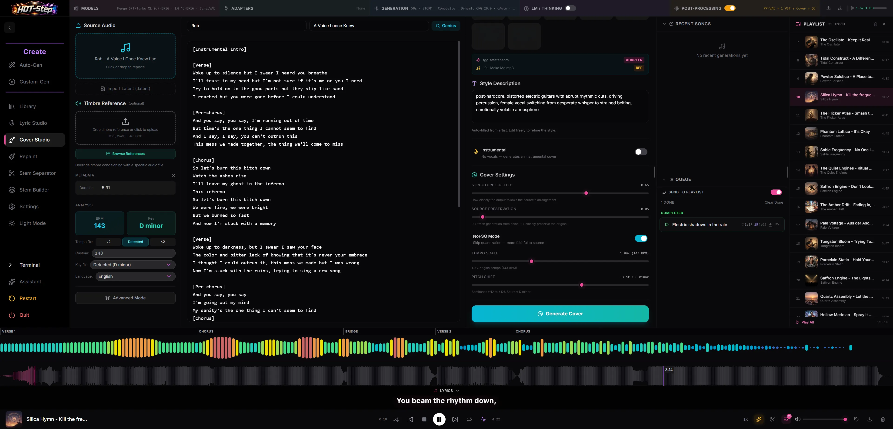

# Cover Studio

Make a new version of a recording. ACE-Step conditions its audio renderer on the
source; YuE2 transcribes the source into a lead sheet and composes from the
reviewed score. Both use your caption and lyrics or an Instrumental choice.

## Where to find it

Sidebar: **Cover Studio**. You need to be signed in to upload a source track, and
the active backend must support covers. ACE and YuE2 offer different cover workflows;
MiniMax-Music3 shows a "not supported" notice. The [backend switcher](../backends.md) appears once a second
backend is registered, so on a single-backend install this is not a decision you
have to make.

## ACE workflow

1. Drop a source track into the upload zone (MP3, WAV, FLAC, OGG, M4A, Opus, AAC),
   or send one over from [Library](library.md) with "Send to Cover Studio". A
   `.latent`/`.hslat` file exported from an earlier HOT-Step generation can be
   imported instead of audio, and pre-fills lyrics, caption, BPM and key from its
   embedded metadata.
2. The upload runs metadata extraction (artist/title/album/duration) and Essentia
   BPM/key analysis automatically. Re-adding a file you already analysed in this
   browser reuses the cached result instead of re-analysing.
3. Fix the analysis if Essentia got it wrong: the ÷2 / Detected / ×2 buttons and a
   free-text BPM box correct tempo halving or doubling, and a key dropdown
   overrides the detected key.
4. Optionally turn on Advanced Mode to split the source into stems, then mute or
   lower individual stems in the mixer that opens. Splitting alone changes
   nothing: an untouched split recombines at full volume, which is the original
   audio.
5. Fill in artist and title and search Genius for lyrics, paste your own, or turn
   on Instrumental to skip lyrics entirely.
6. Pick a target artist tile (optional). It auto-fills the Style Description from
   that artist's profile or past generations, and if a matching album preset
   carries an adapter, loads that adapter (and its reference track, if any) for
   the render. Skip this and write the Style Description yourself for an
   artist-free cover, using the Caption LLM button to draft one if you like.
7. Set Structure Fidelity, Source Preservation, Tempo Scale and Pitch Shift, and
   optionally a Timbre Reference track, then generate.

## YuE2 workflow

1. Upload a source recording of at most 100 MB and 10 minutes, or send a song
   from Library. Detected BPM and key
   are shown for reference; they do not change the YuE2 cover request. Advanced
   Mode can split and mix stems before transcription.
2. Click **Transcribe melody**. The score panel shows queue and transcription
   progress, with Cancel and Retry. SheetSage2 must be registered for automatic
   transcription; if it is missing, the panel shows the model setup guidance.
   You can paste ABC in the editor instead, without SheetSage2. Neither path
   uses the source audio as an inference conditioning signal after approval.
3. Preview the ABC, correct it in the editor, and click **Approve score**. Editing
   the score or changing the source audio or stem mix withdraws approval. The
   Generate button stays disabled until the current source has an approved score.
4. Paste lyrics or search by artist and title; choose **Instrumental** to render
   without lyrics. Write a YuE2 style caption. With an adapter pair, you can
   choose a caption from its training tracks or the nearest detected BPM.
5. Choose **Base YuE2** or an explicit AR composer and NAR renderer pair.
   **Melody only** is the default score conditioning. Choose **Full score** if
   you have added chords to the ABC and want to follow that harmony. Click
   **Generate YuE2 cover**; queued renders keep the selected pair, score and
   settings from that click even if the picker changes later.

YuE2 does not use ACE's fidelity, source-preservation/noise, NoFSQ, timbre,
latent, tempo, pitch or BPM/key correction controls. A completed YuE2 cover
uses the ordinary generation queue and appears in Library. Its saved job records
the source identity and the ABC that was rendered.

## ACE-Step controls

| Control | What it does |
|---|---|
| Source Audio | Upload zone for the reference track. Drag-drop or click to browse. |
| Latent import | Alternative to Source Audio: load a `.latent`/`.hslat` file and reuse its embedded lyrics/caption/BPM/key. |
| Timbre Reference (optional) | A second reference track (upload or pick from saved references) fed to the engine as a DiT timbre conditioner, independent of any adapter's own reference track. |
| Tempo fix: ÷2 / Detected / ×2 | Corrects Essentia's common tempo halving/doubling error. |
| Custom (BPM) | Free-text BPM override, 20 to 300, replaces the corrected detected value. |
| Key fix | Dropdown of all 24 major/minor keys, overrides the detected key. |
| Language | Vocal language used for the generation. |
| Advanced Mode | Splits the source into stems (SuperSep, selectable separation level), then opens a mixer for muting or attenuating individual stems before generation. |
| Target Artist (optional) | Grid of trained artists. Selecting one auto-fills Style Description and, when available, an album adapter preset. |
| Album | Appears when the selected artist has more than one album preset with an adapter; picks which one to apply. |
| Style Description | Free-text caption for genre, instruments, vocal style, production and mood. Auto-filled from the target artist, always editable. Its Generate button redrafts it with the selected Caption LLM provider on demand; the same provider fills it automatically on artist selection when no existing caption is found. |
| Instrumental | Skips the lyrics requirement and sends the track as instrumental. |
| Structure Fidelity | 0 to 1, default 0.5. How closely the output follows the source's arrangement. |
| Source Preservation | 0 to 1, default 0. "0 = fresh generation from noise, 1 = closely preserve the original." Above 0, a Noise Method choice appears. Classic (Truncate), the default, drops the early steps and runs the rest. Full Denoise (Rescale) runs the same number of steps, spaced by the selected scheduler across the remaining range. |
| NoFSQ Mode | Toggle. Skips FSQ quantization for a result closer to the source. |
| Tempo Scale | 0.5x to 2.0x, default 1.0. Scales the target BPM from the (corrected) source BPM. |
| Pitch Shift | -12 to +12 semitones, default 0. Shows the transposed target key live. |

Every slider's value is click-to-edit: click the number next to a slider to type
an exact figure instead of dragging. A reset arrow appears beside a label whenever
its value has moved from the default; click it to snap that one field back.

## Tips and limits

- Cover generation needs ACE or YuE2 active. MiniMax-Music3 replaces the studio
  with a not-supported notice.
- Splitting into stems is step one of two. The split by itself does not change the
  render; the mixer is where muting or lowering a stem actually removes it from
  the cover.
- For ACE-Step, BPM/key detection depends on the bundled Essentia analyzer. If it returns a
  wrong value, use the tempo-fix and key-fix controls above to correct it. If it
  fails outright, the source loads with no detected-BPM/key panel at all and
  generation falls back to a default of 120 BPM.
- Source filename, detected metadata and lyrics are cached in the browser, so
  re-uploading a track you already analysed here skips analysis and reuses the
  cache.
- Covers queue rather than block the UI: you can adjust settings and start another
  cover while one is still rendering.
- For ACE-Step, if Whisper lyric transcription is enabled in [generation](../generation.md)
  settings, generated covers get the same LRC-synced lyrics as any other track.
- Finished covers save to the library tagged with their source, alongside every
  other generation; open [Library](library.md) to find, play or export one.

## Related

- [Create](create.md)
- [Repaint Studio](repaint-studio.md)
- [Library](library.md)
- [Generation](../generation.md)
- [Backends](../backends.md)
- [Adapters](../adapters.md)
